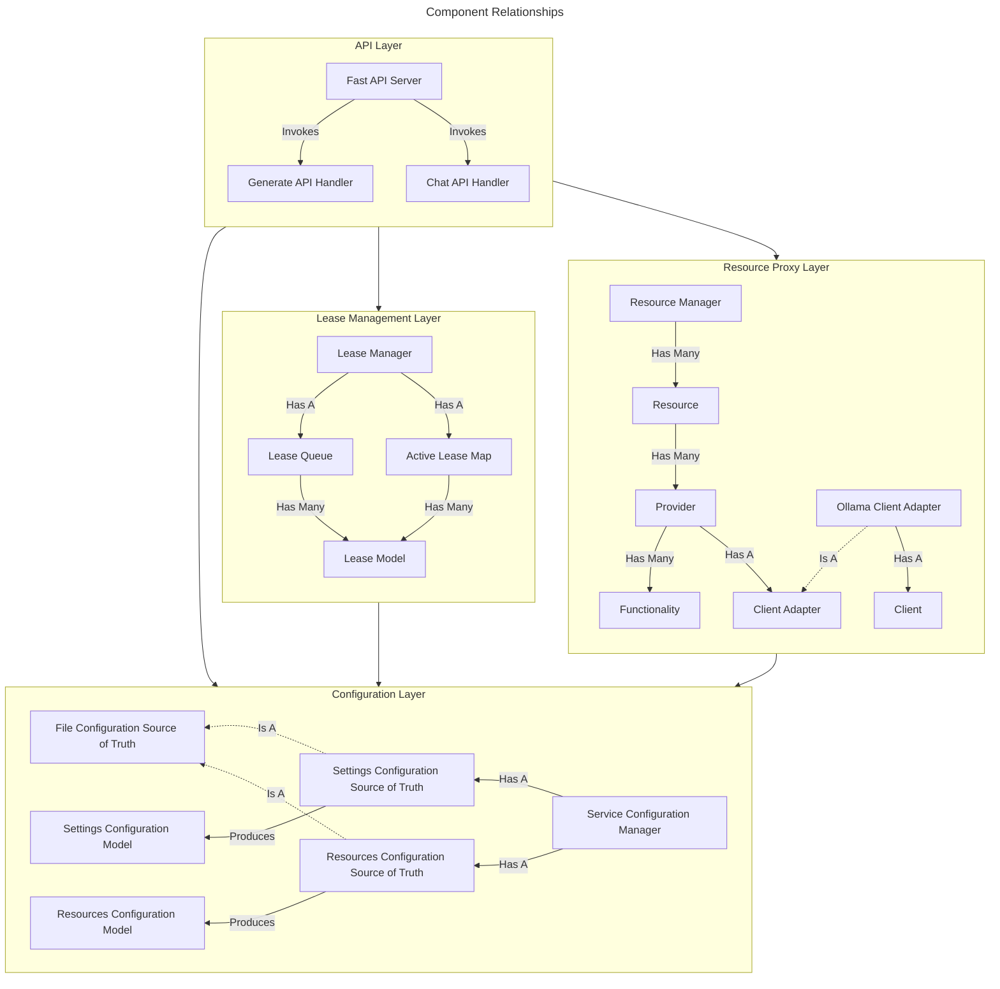

# Release v0.1.0

**Type:** Alpha \
**Goal:** A simple wrapper API over Ollama's base API, mirroring `generate` and `chat` APIs exactly

## Feature Implementation Targets

The following features are targeted for implementation at this version.

### File-based Configuration

Basic service settings and onboarded resources will be configurable via YAML files at the default `<app-root>/config/` directory.

Current supported files:
- `settings.yml`/`settings.yaml` - Service settings
- `resources.yml`/`resources.yaml` - Resource configurations

Current supported `settings` file format and default values:
```yaml
# API layer config
api:
    http_port: 3440
```

Current supported `resources` file format and default values:
```yaml
resources:
    # Unique string id, used in API requests (slug, unique)
  - slug: example-resource
    # Display name for use by clients and future features
    display_name: "Example Resource"
    # List of providers
    providers:
        # Provider id, used in API requests (slug, unique)
      - slug: "example-api-provider"
        # Provider display name
        display_name: "Example API Provider"
        # Currently supported values: [api]
        provider_type: api
        # Detail model dependent on provider type, example shows API type provider details
        provider_details:
            # API spec, currently supported values: [ollama]
            spec: ollama
            host: localhost
            port: 11434 # Ollama default port
```

### On-demand Single-request Leasing

The `generate` and `chat` APIs will be implemented exactly as in the Ollama API. When a request is received, if a resource is free that resource will become leased, but only for the duration of the request, after which it will be released. However, if no suitable resources are free, the API will return a `503 Service Unavailable` response. This will essentially be a pass-through for the `generate` and `chat` APIs, only normal request queueing will be disabled.

#### Generate API Spec

An exact replica of Ollama's `generate` API schema.

Path: `/api/generate` \
Method: `POST` \
Request Body (`application/json`):
```json
{
    // [Required, string] Model name
    "model": "string",
    // [Optional, string] Text for the model to generate a response from
    "prompt": "string",
    // [Optional, string] Used for fill-in-the-middle models, text that appears after the user prompt and before the model response
    "suffix": "string",
    // [Optional, string[]] Base64-encoded images for models that support image input
    "images": ["string"],
    // [Optional, enum string OR object] Structured output format for the model to generate a response from. Supports either the string `"json"` or a JSON schema object
    "format": "json",
    // [Optional, string] System prompt for the model to generate a response from
    "system": "string",
    // [Optional, boolean] When true, returns a stream of partial responses
    "stream": false,
    // [Optional, boolean] When true, returns separate thinking output in addition to content. Can be a boolean (true/false) or a string ("high", "medium", "low", "max") for supported models, with "max" requesting the highest thinking level.
    "think": false,
    // [Optional, boolean] When true, returns the raw response from the model without any prompt templating
    "raw": false,
    // [Optional, string] Model keep-alive duration (for example `5m` or `0` to unload immediately)
    "keep_alive": "string",
    // [Optional, object] Runtime options that control text generation
    "options": {
        // [Optional, integer] Random seed used for reproducible outputs
        "seed": 0,
        // [Optional, float] Controls randomness in generation (higher = more random)
        "temperature": 0.0,
        // [Optional, integer] Limits next token selection to the K most likely
        "top_k": 0,
        // [Optional, float] Cumulative probability threshold for nucleus sampling
        "top_p": 0.0,
        // [Optional, float] Minimum probability threshold for token selection
        "min_p": 0.0,
        // [Optional, string OR string[]] Stop sequences that will halt generation
        "stop": ["string"],
        // [Optional, integer] Context length size
        "num_ctx": 0,
        // [Optional integer] Maximum number of tokens to generate
        "num_predict": 0
    },
    // [Optional, boolean] Whether to return log probabilities of output tokens
    "logprobs": false,
    // [Optional, integer] Number of most likely tokens to return at each position when logprobs are enabled
    "top_logprobs": 0
}
```
Response Body (`application/json`):
```json
{
    // Model name
    "model": "string",
    // ISO 8601 timestamp of response creation
    "created_at": "string",
    // The model's generated text response
    "response": "string",
    // The model's generated thinking output
    "thinking": "string",
    // Indicates whether generation has finished
    "done": false,
    // Reason the generation stopped
    "done_reason": "string",
    // Time spent generating the response in nanoseconds
    "total_duration": 0,
    // Time spend loading the model in nanoseconds
    "load_duration": 0,
    // Number of input tokens in the prompt
    "prompt_eval_count": 0,
    // Time spent evaluating the prompt in nanoseconds
    "prompt_eval_duration": 0,
    // Number of output tokens generated in the response
    "eval_count": 0,
    // Time spent generating tokens in seconds
    "eval_duration": 0,
    // Log probability infromation for the generated tokens where logprobs are enabled
    "logprobs": [
        {
            // The text representation of the token
            "token": "string",
            // The log probability of this token
            "logprob": 0,
            // The raw byte representation of the token
            "bytes": [0],
            // Most likely tokens and their log probabilities at this position
            "top_logprobs": [
                {
                    // The text representation of the token
                    "token": "string",
                    // The log probability of this token
                    "logprob": 0,
                    // The raw byte representation of the token
                    "bytes": [0]
                }
            ]
        }
    ]
}
```
Response Body (`application/x-ndjson`):
```json
{
    // Model name
    "model": "string",
    // ISO 8601 timestamp of response creation
    "created_at": "string",
    // The model's generated text response for this chunk
    "response": "string",
    // The model's generated thinking output for this chunk
    "thinking": "string",
    // Indicates whether the stream has finished
    "done": false,
    // Reason streaming finished
    "done_reason": "string",
    // Time spent generating the response in nanoseconds
    "total_duration": 0,
    // Time spent loading the model in nanoseconds
    "load_duration": 0,
    // Number of input tokens in the prompt
    "prompt_eval_count": 0,
    // Time spent evaluating the prompt in nanoseconds
    "prompt_eval_duration": 0,
    // Number of output tokens generated in the response
    "eval_count": 0,
    // Time spent generating tokens in nanoseconds
    "eval_duration": 0
}
```

#### Chat API Spec

An exact replica of Ollama's `chat` API schema.

Path: `/api/chat` \
Method: `POST` \
Request Body (`application/json`):
```json
{
    // [Required, string] model name
    "model": "string",
    // [Required, object[]] Chat history as an array of message objects (each with a role and content)
    "messages": [
        {
            // [Required, enum string] Author of the message
            "role": "system|user|assistant|tool",
            // [Required, string] Message text content
            "content": "string",
            // [Optional, string[]] List of base64-encoded inline images for multimodal models
            "images": ["string"],
            // [Optional, object[]] Tool call requests produced by the model
            "tool_calls": [
                {
                    // [Required, object] Function definition
                    "function": {
                        // [Required, string] Name of the function to call
                        "name": "string",
                        // [Optional, string] What the function does
                        "description": "string",
                        // [Optional, object] JSON object of arguments to pass the function
                        "arguments": {}
                    }
                }
            ]
        }
    ],
    // [Optional, object[]] Optional list of function tools the model may call during the chat
    "tools": [
        {
            // [Required, enum string] Type of tool (always `function`)
            "type": "function",
            // [Required, object] Function definition
            "function": {
                // [Required, string] Function name exposed to the model
                "name": "string",
                // [Optional, string] Human-readable description of the function
                "description": "string",
                // [Required, object] JSON Schema for the function parameters
                "parameters": {}
            }
        }
    ],
    // [Optional, enum string OR object] Structured output format for the model to generate a response from. Supports either the string `"json"` or a JSON schema object
    "format": "json",
    // [Optional, boolean] When true, returns a stream of partial responses
    "stream": false,
    // [Optional, boolean] When true, returns separate thinking output in addition to content. Can be a boolean (true/false) or a string ("high", "medium", "low", "max") for supported models, with "max" requesting the highest thinking level.
    "think": false,
    // [Optional, string] Model keep-alive duration (for example `5m` or `0` to unload immediately)
    "keep_alive": "string",
    // [Optional, object] Runtime options that control text generation
    "options": {
        // [Optional, integer] Random seed used for reproducible outputs
        "seed": 0,
        // [Optional, float] Controls randomness in generation (higher = more random)
        "temperature": 0.0,
        // [Optional, integer] Limits next token selection to the K most likely
        "top_k": 0,
        // [Optional, float] Cumulative probability threshold for nucleus sampling
        "top_p": 0.0,
        // [Optional, float] Minimum probability threshold for token selection
        "min_p": 0.0,
        // [Optional, string OR string[]] Stop sequences that will halt generation
        "stop": ["string"],
        // [Optional, integer] Context length size
        "num_ctx": 0,
        // [Optional integer] Maximum number of tokens to generate
        "num_predict": 0
    },
    // [Optional, boolean] Whether to return log probabilities of output tokens
    "logprobs": false,
    // [Optional, integer] Number of most likely tokens to return at each position when logprobs are enabled
    "top_logprobs": 0
}
```
Response Body (`application/json`):
```json
{
    // Model name used to generate this message
    "model": "string",
    // Timestamp of response creation (ISO 8601)
    "created_at": "string",
    // Message generated by model
    "message": {
        // Always `assistant` for model responses
        "role": "assistant",
        // Assistant message text
        "content": "string",
        // Optional deliberate thinking trace when think is enabled
        "thinking": "string",
        // Tool calls requested by the assistant
        "tool_calls": [
            {
                // Function definition
                "function": {
                    // Name of the function to call
                    "name": "string",
                    // What the function does
                    "description": "string",
                    // JSON object of arguments to pass to the function
                    "arguments": {}
                }
            }
        ],
        // Optional base64-encoded images in the response
        "images": ["string"]
    },
    // Indicates whether the chat response has finished
    "done": false,
    // Reason the response finished
    "done_reason": "string",
    // Total time spent generating in nanoseconds
    "total_duration": 0,
    // Time spent loading the model in nanoseconds
    "load_duration": 0,
    // Number of tokens in the prompt
    "prompt_eval_count": 0,
    // Time spent evaluating the prompt in nanoseconds
    "prompt_eval_duration": 0,
    // Number of tokens generated in the response
    "eval_count": 0,
    // Time spent generating tokens in nanoseconds
    "eval_duration": 0,
    // Log probability information for the generated tokens when logprobs are enabled
    "logprobs": [
        {
            // The text representation of the token
            "token": "string",
            // The log probability of this token
            "logprob": 0.0,
            // The raw byte representation of the token
            "bytes": [0],
            // Most likely tokens and their log probabilities at this position
            "top_logprobs": [
                {
                    // The text representation of the token
                    "token": "string",
                    // The log probability of this token
                    "logprob": 0.0,
                    // The raw byte representation of the token
                    "bytes": [0]
                }
            ]
        }
    ]
}
```
Response Body (`application/x-ndjson`):
```json
{
    // Model name used to generate this message
    "model": "string",
    // Timestamp of response creation (ISO 8601)
    "created_at": "string",
    // Message generated by model
    "message": {
        // Always `assistant` for model responses
        "role": "assistant",
        // Assistant message text
        "content": "string",
        // Optional deliberate thinking trace when think is enabled
        "thinking": "string",
        // Tool calls requested by the assistant
        "tool_calls": [
            {
                // Function definition
                "function": {
                    // Name of the function to call
                    "name": "string",
                    // What the function does
                    "description": "string",
                    // JSON object of arguments to pass to the function
                    "arguments": {}
                }
            }
        ],
        // Optional base64-encoded images in the response
        "images": ["string"]
    },
    // Indicates whether the chat response has finished
    "done": false
}
```

## Component Implementation Targets

The following components are targeted for implementation at this version.



## Release Notes

... TBD ...

## Known Issues

... TBD ...
